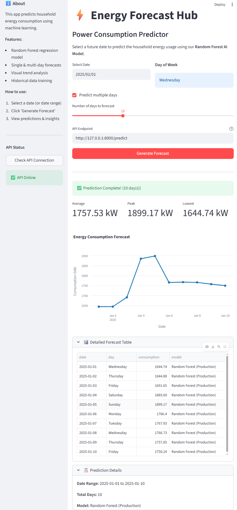

# ⚡ Energy Forecast Hub



A Machine Learning application that predicts household power consumption using Random Forest regression. The system includes a FastAPI backend and Streamlit dashboard, fully containerized with Docker.

---

## 🎯 What It Does

Predicts future household energy consumption based on historical patterns. Users can forecast single days or multiple days ahead through an interactive web interface or REST API.

---


## The Data
Available in **df_train.csv** and **df_test.csv**:

| Column           | Type | Description |
|------------------|------|-------------|
| date             | chr  | Date of the measurement |
| power_consumption| dbl  | Daily power consumption (in kilowatts) |
| year             | int  | Year of the measurement |
| semester         | int  | Semester of the measurement (1 for Jan–Jun, 2 for Jul–Dec) |
| quarter          | int  | Quarter of the measurement (1 for Q1, 2 for Q2, 3 for Q3, 4 for Q4) |
| day_in_week      | chr  | Day of the week (e.g., Monday, Tuesday) |
| week_in_year     | int  | Week number in the year |
| day_in_year      | int  | Day number in the year |
| month            | int  | Month of the year |

---

## 🛠️ Tech Stack

**Python Implementation:**
- Python 3.9
- Scikit-Learn
- FastAPI, Streamlit
- Docker

**Future Implementations:**
- Julia (planned)

---

## 🚀 Quick Start

### Using Docker (Recommended)

```bash
# Clone repository
git clone https://github.com/YOUR_USERNAME/energy-forecast-hub.git
cd energy-forecast-hub

# Launch application
docker-compose up --build

# Access services
# Dashboard: http://localhost:8501
# API: http://localhost:8000/docs
```

### Manual Installation

```bash
# Create virtual environment
python -m venv venv
source venv/bin/activate  # Linux/Mac
# or
.\venv\Scripts\activate  # Windows

# Install dependencies
pip install -r requirements.txt

# Train models
python main.py

# Run backend (Terminal 1)
uvicorn app:app --reload

# Run frontend (Terminal 2)
streamlit run dashboard.py
```

---

## 📁 Project Structure

```
energy-forecast-hub/
│
├── data/                   # Dataset files (Shared by Python & R)
│   ├── df_train.csv
│   └── df_test.csv
│
├── models/                 # Python Models
│   └── production_model.pkl.joblib
│
├── src/                    # Python ML Source Code
│   ├── preprocessing.py
│   ├── training.py
│   ├── evaluation.py
│   └── visualization.py
│
├── R_project/              # R Implementation (New)
│   ├── models/             # R Models (.rds)
│   ├── R/                  # R Source Code
│   │   └── processing.R    # Feature engineering logic
│   ├── train_comparison.R  # Training script
│   └── install_packages.R  # Dependency installer
│
├── app.py                  # FastAPI Backend (Python)
├── dashboard.py            # Streamlit Frontend (Python)
├── main.py                 # Training script (Python)
├── docker-compose.yml      # Orchestration
├── Dockerfile              # Container definition
├── requirements.txt        # Python Dependencies
└── README.md               # Documentation
```

---

## 📊 Model Performance Comparison

| Model | Python | R | Notes |
|-------|---------------------|---------------|--------|
| | RMSE (kW) | RMSE (kW) | |
| **Random Forest** | **431.93** | **383.10** | 🏆 Winner |
| XGBoost | 475.27 | 463.00 | Consistently strong |
| Linear Regression | 504.30 | 505.00 | Baseline model |

---

## 🔌 API Usage

**Endpoint:** `POST /predict`

**Request:**
```json
{
  "date": "2025-12-25"
}
```

**Response:**
```json
{
  "predicted_consumption_kw": 1234.56,
  "model_used": "Random Forest",
  "input_date": "2025-12-25",
  "day_of_week": "Thursday"
}
```

**Example:**
```bash
curl -X POST "http://localhost:8000/predict" \
     -H "Content-Type: application/json" \
     -d '{"date": "2025-12-25"}'
```

---

## 📚 Dataset

**Source:** UCI Machine Learning Repository  
**Period:** December 2006 - November 2010  

**Citation:**
> Hebrail, G., & Berard, A. (2012). Individual household electric power consumption [Dataset]. UCI Machine Learning Repository. https://doi.org/10.24432/C58K54

---


## Author

GitHub: [@JeffersonConza](https://github.com/JeffersonConza)
