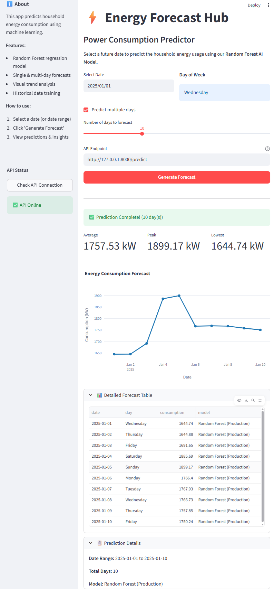
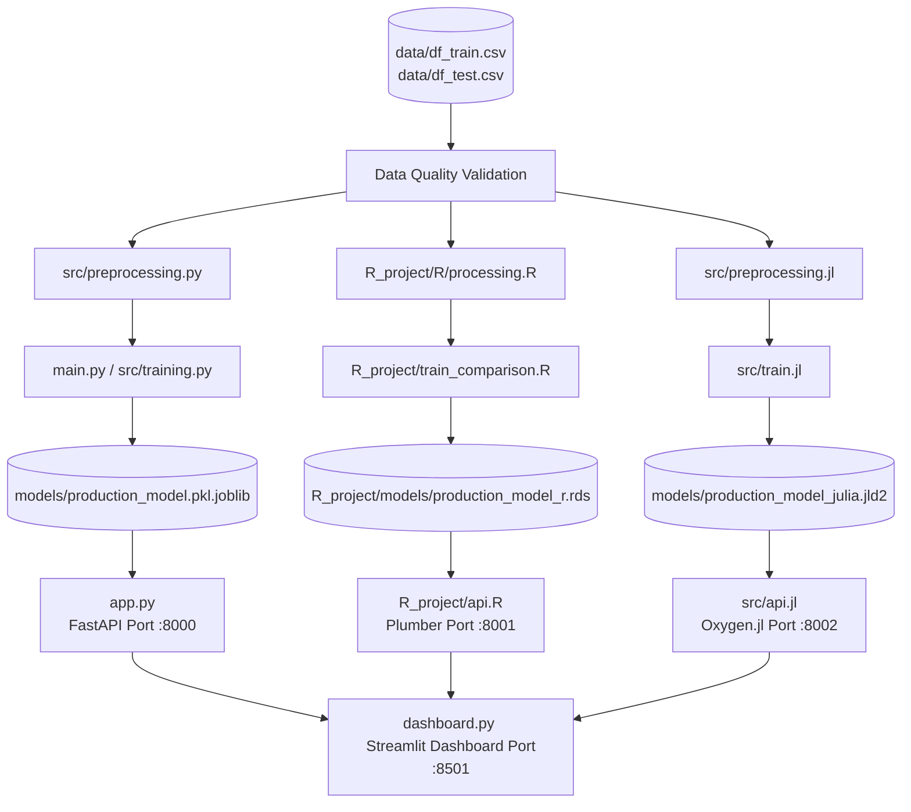

# ⚡ Energy Forecast Hub



A high-performance multi-language machine learning application designed to predict household daily energy consumption. The system implements identical feature engineering pipelines and trains **Random Forest** regression models across three separate language runtimes (**Python**, **R**, and **Julia**), served via independent REST microservices, and unified under a single performance-profiling **Streamlit** dashboard.

---

## 🏢 Target Architecture


```mermaid
graph TD
    %% Shared Data Source
    Data[(data/df_train.csv<br/>data/df_test.csv)] --> Validation[Data Quality Validation]

    %% Python Service
    Validation --> PyPrep[src/preprocessing.py]
    PyPrep --> PyTrain[main.py / src/training.py]
    PyTrain --> PyModel[(models/production_model.pkl.joblib)]
    PyModel --> PyAPI[app.py <br/> FastAPI Port :8000]

    %% R Service
    Validation --> RPrep[R_project/R/processing.R]
    RPrep --> RTrain[R_project/train_comparison.R]
    RTrain --> RModel[(R_project/models/production_model_r.rds)]
    RModel --> RAPI[R_project/api.R <br/> Plumber Port :8001]

    %% Julia Service
    Validation --> JuPrep[src/preprocessing.jl]
    JuPrep --> JuTrain[src/train.jl]
    JuTrain --> JuModel[(models/production_model_julia.jld2)]
    JuModel --> JuAPI[src/api.jl <br/> Oxygen.jl Port :8002]

    %% Streamlit Frontend Comparison Dashboard
    PyAPI --> Streamlit[dashboard.py <br/> Streamlit Dashboard Port :8501]
    RAPI --> Streamlit
    JuAPI --> Streamlit
```

---

## 🎯 Key Features
* **Aligned Feature Engineering:** Identical temporal mapping (ISO week, semester, quarter, day name) and a pre-calculated 7-day rolling average lookup table prevent forward data leakage and ensure comparative rigor.
* **Chronological Validation:** TimeSeriesSplit (5-fold validation) is implemented natively in all three runtimes for fair model comparison.
* **Production-Grade Microservices:** Served via FastAPI (Python), Plumber (R), and Oxygen.jl (Julia) with CORS support, structured logging, and flat JSON output formatting.
* **Unified Profiler Dashboard:** Compare predictions side-by-side, analyze pings, and profile execution latencies in real-time.

---

## 📁 Project Structure

```text
energy-forecast-hub/
├── data/                       # Shared Datasets
│   ├── df_train.csv
│   └── df_test.csv
├── models/                     # Python & Julia Model Outputs
│   ├── production_model.pkl.joblib
│   └── production_model_julia.jld2
├── src/                        # Python & Julia Source Code
│   ├── __init__.py
│   ├── preprocessing.py        # Python preprocessor
│   ├── training.py             # Python training library
│   ├── evaluation.py
│   ├── visualization.py
│   ├── preprocessing.jl        # Julia preprocessor module
│   ├── train.jl                # Julia ML pipeline script
│   └── api.jl                  # Julia Oxygen.jl service
├── R_project/                  # R Language Module
│   ├── models/                 # R Model Outputs
│   │   └── production_model_r.rds
│   ├── R/
│   │   └── processing.R        # R preprocessor
│   ├── train_comparison.R      # R ML pipeline script
│   ├── api.R                   # R Plumber REST service
│   ├── app.R                   # Legacy Shiny App
│   └── install_packages.R      # Package installer
├── app.py                      # Python FastAPI service
├── dashboard.py                # Streamlit comparison dashboard
├── main.py                     # Python training entrypoint
├── docker-compose.yml          # Container Orchestration
├── pyproject.toml              # Python Poetry package locks
├── renv.lock                   # R renv package locks
├── Project.toml                # Julia environment config
└── README.md                   # This documentation
```

---

## 📊 Cross-Language Model Performance

Model validation and hold-out test results (RMSE in kW) achieved across Python, R, and Julia:

| Metric / Model | Python | R | Julia |
| :--- | :---: | :---: | :---: |
| **CV Mean RMSE - Linear Regression** | 549.62 kW | 1731.00 kW* | 548.23 kW |
| **CV Mean RMSE - XGBoost** | 533.88 kW | 547.00 kW | 614.27 kW |
| **CV Mean RMSE - Random Forest (Winner)** | **453.43 kW** | **419.00 kW** | **435.81 kW** |
| **Hold-Out Test Set RMSE (Final)** | **383.15 kW** | **370.36 kW** | **369.50 kW** |

*\*Note: R's Linear Regression results in a rank-deficient fit due to dummy variables, causing higher RMSE unless collinear columns are explicitly pruned.*

---

## 🚀 Local Quick Start

### 1. Python Environment (Poetry)
```bash
# Install dependencies
python -m poetry install

# Train model
python -m poetry run python main.py

# Run API (Port 8000)
python -m poetry run uvicorn app:app --host 0.0.0.0 --port 8000
```

### 2. R Environment (renv)
```bash
# Restore packages
Rscript -e "setwd('R_project'); renv::restore()"

# Train model
Rscript R_project/train_comparison.R

# Run Plumber API (Port 8001)
Rscript -e "pr <- plumber::pr('R_project/api.R'); plumber::pr_run(pr, host='0.0.0.0', port=8001)"
```

### 3. Julia Environment (Pkg)
```bash
# Instantiate packages
julia --project="." -e "using Pkg; Pkg.instantiate(); Pkg.precompile()"

# Train model
julia --project="." src/train.jl

# Run Oxygen.jl API (Port 8002)
julia --project="." src/api.jl
```

### 4. Streamlit Dashboard
```bash
# Start front-end (Port 8501)
python -m poetry run streamlit run dashboard.py
```

---

## 🔌 REST API Specifications

### Health Check
* **Endpoint:** `GET /`
* **Response Signature:** `{"status": "online", "language": "<Python/R/Julia>"}`

### Predict Endpoint
* **Endpoint:** `POST /predict`
* **Payload:** `{"date": "YYYY-MM-DD"}`
* **Response Signature:**
```json
{
  "date": "YYYY-MM-DD",
  "predicted_consumption_kw": 1234.56,
  "model_used": "Random Forest (Production)"
}
```

#### Example request:
```bash
curl -X POST -H "Content-Type: application/json" -d '{"date": "2026-06-23"}' http://localhost:8000/predict
```

---

## 📚 Dataset Reference
* **Source:** UCI Machine Learning Repository
* **Period:** December 2006 - November 2010
* **Citation:** Hebrail, G., & Berard, A. (2012). Individual household electric power consumption [Dataset]. UCI Machine Learning Repository. https://doi.org/10.24432/C58K54

---

## Author
* **GitHub:** [@JeffersonConza](https://github.com/JeffersonConza)
