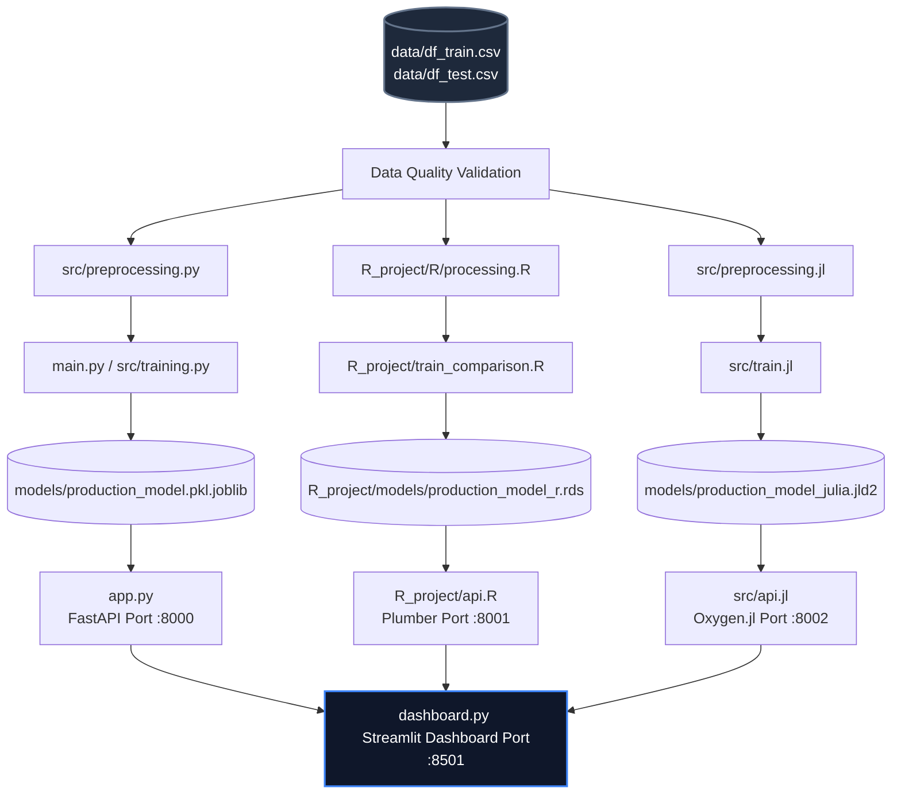

# ⚡ Energy Forecast Hub Remake: Master Instruction & Project Guide

> **AI System Prompt Directive:** You are a senior full-stack AI engineer and machine learning expert. Your task in this chat is to implement the full remake of the **Energy Forecast Hub** project according to the target architecture, feature engineering constraints, REST endpoints, and orchestration specifications outlined in this guide. Read this document carefully and proceed systematically.

---

## 🎯 Project Overview & Objective

The **Energy Forecast Hub** is a multi-language forecasting application designed to predict household power consumption using historical data. The objective of this remake is to build identical, concurrent training and inference pipelines in **Python**, **R**, and **Julia**, served by individual microservice APIs, and unified under a single performance-tracking frontend dashboard.

---

## 🏢 Target Architecture



---

## 📁 Workspace Structure

Your workspace must align with the following directory tree:

```text
energy-forecast-hub/
├── data/                       # Shared Datasets
│   ├── df_train.csv
│   └── df_test.csv
├── models/                     # Python & Julia Model Outputs
│   ├── production_model.pkl.joblib
│   └── production_model_julia.jld2
├── src/                        # Python & Julia Source Code
│   ├── __init__.py
│   ├── preprocessing.py        # Python preprocessor
│   ├── training.py             # Python training library
│   ├── evaluation.py
│   ├── visualization.py
│   ├── preprocessing.jl        # Julia preprocessor module
│   ├── train.jl                # Julia ML pipeline script
│   └── api.jl                  # Julia Oxygen.jl service
├── R_project/                  # R Language Module
│   ├── models/                 # R Model Outputs
│   │   └── production_model_r.rds
│   ├── R/
│   │   └── processing.R        # R preprocessor
│   ├── train_comparison.R      # R ML pipeline script
│   ├── api.R                   # R Plumber REST service
│   ├── app.R
│   └── install_packages.R
├── app.py                      # Python FastAPI service
├── dashboard.py                # Streamlit comparison dashboard
├── main.py                     # Python training entrypoint
├── docker-compose.yml          # Container Orchestration
├── Dockerfile.python           # Python service containerization
├── Dockerfile.r                # R service containerization
├── Dockerfile.julia            # Julia service containerization (optimized sysimage)
├── Dockerfile.dashboard        # Streamlit dashboard containerization
├── pyproject.toml              # Python Poetry package locks
├── renv.lock                   # R renv package locks
├── Project.toml                # Julia environment config
└── remake_guideline.md         # This instructions file
```

---

## 🛠️ Step-by-Step Implementation Blueprint

### Phase 1: Environment & Dependency Management
Isolate dependencies across all runtimes to ensure deterministic builds.

1.  **Python**: Use Poetry. Replace the raw `requirements.txt` with a `pyproject.toml` containing:
    *   `python = "^3.9"` or compatible
    *   `fastapi`, `uvicorn`, `scikit-learn`, `xgboost`, `pandas`, `joblib`, `loguru`, `pydantic`, `streamlit`, `plotly`
2.  **R**: Run `Rscript -e "renv::init()"` to initialize dependency management. Pin `tidyverse`, `lubridate`, `plumber`, `tidymodels`, `ranger`, `xgboost`, and `slider`.
3.  **Julia**: Initialize a local workspace in the root directory. Instantiate `CSV`, `DataFrames`, `Dates`, `JLD2`, `MLJ`, `DecisionTree`, `XGBoost`, `Oxygen`, `JSON3`, and `HTTP`.

---

### Phase 2: Feature Engineering Alignment
To achieve comparable evaluation and identical predictions, all preprocessing code must handle timestamps identically and engineer identical features.

*   **Inputs**: A DataFrame containing a `date` column and optional `power_consumption` (target).
*   **Outputs**: A DataFrame containing the target and the engineered features.

#### Feature Generation Specifications:
1.  **`date`**: Parsed into Date/DateTime representation.
2.  **`year`**: Calendar year of the observation (Integer).
3.  **`month`**: Month number, `1` to `12` (Integer).
4.  **`semester`**: `1` if `month` is $\le 6$, otherwise `2` (Integer).
5.  **`quarter`**: Quarter of the year, `1` to `4` (Integer).
6.  **`day_in_week`**: Full day name in English, e.g., `"Monday"`, `"Tuesday"`, etc. (String / Factor).
7.  **`week_in_year`**: ISO week number (Integer).
8.  **`day_in_year`**: Cumulative day of the year, `1` to `366` (Integer).
9.  **`power_rolling_mean_7d`**: The average power consumption over the preceding 7 days, excluding the current day's value (calculated by applying a lag of 1 day and computing a rolling 7-day average).

---

### Phase 3: Machine Learning & Validation Pipelines
Train three regression models in each language: **Linear Regression**, **Random Forest**, and **XGBoost**.

*   **Validation Method**: Do not use simple random splitting. Implement `TimeSeriesSplit` cross-validation (5 splits) to prevent forward data leakage.
*   **Best Model Selection**: The script must calculate RMSE across validation folds, display comparison metrics, select the top-performing model, and serialize it to the designated model output path.

#### Models Specs:
*   **Random Forest**: 1000 estimators/trees, seed/random state 42.
*   **XGBoost**: 1000 estimators/trees, maximum depth of 6, seed/random state 42.

---

### Phase 4: Production REST APIs
Expose the best-performing model in each language via HTTP REST services.

#### Endpoints:
1.  `GET /` (Health check)
    *   Response: `{"status": "online", "language": "<Python/R/Julia>"}`
2.  `POST /predict` (Inference)
    *   Payload: `{"date": "YYYY-MM-DD"}`
    *   Response format:
        ```json
        {
          "date": "YYYY-MM-DD",
          "predicted_consumption_kw": 1234.56,
          "model_used": "Random Forest (Production)"
        }
        ```

*   **Python (FastAPI)**: Run asynchronously using Uvicorn. Implement custom CORS middleware, Pydantic JSON body models, and structured logging. Expose on port **8000**.
*   **R (Plumber)**: Configure custom Plumber handlers. Include logging middlewares and output float rounding. Expose on port **8001**.
*   **Julia (Oxygen.jl)**: Create clean routing handlers. Load the JLD2 serialized pipeline on startup. Expose on port **8002**.

---

### Phase 5: Unified Comparison Streamlit Dashboard
Create a responsive dashboard using Streamlit ([dashboard.py](file:///mnt/c/Users/jconza/Downloads/energy-forecast-hub/dashboard.py)).

#### Dashboard Deliverables:
*   **Sidebar Configuration**: Allow users to select the date range for forecasting, or enter a specific date to query.
*   **Backend Selector**: Allow selecting individual backends (Python, R, Julia) or choosing "Compare All" to run them concurrently.
*   **Data Caching**: Annotate data fetch processes with `@st.cache_data` using short TTL settings.
*   **Visualization**: Render line charts in Plotly comparing predicted consumption values across the chosen backends.
*   **Profiler/Metrics Grid**: Provide execution latency metrics in milliseconds for each backend response, alongside container status indicators.
*   **Graceful Degrades**: Catch server connection timeouts and show user-friendly error dialogs if any backend microservice goes offline.

---

## 🚀 Execution Guide for the AI Developer

When beginning the remake, execute your work in the following sequential order:

1.  **Dependencies Setup**:
    *   Initialize and construct `pyproject.toml`, `renv.lock`, and the Julia project environment.
    *   Ensure all three developer environments are operational on your host machine or dev container.
2.  **Align Preprocessing**:
    *   Write [src/preprocessing.py](file:///mnt/c/Users/jconza/Downloads/energy-forecast-hub/src/preprocessing.py), [R_project/R/processing.R](file:///mnt/c/Users/jconza/Downloads/energy-forecast-hub/R_project/R/processing.R), and `src/preprocessing.jl`.
    *   Write validation assertions to guarantee the outputs match for a selection of edge-case dates.
3.  **Train the Models**:
    *   Run Python training: `poetry run python main.py`
    *   Run R training: `Rscript R_project/train_comparison.R`
    *   Run Julia training: `julia --project="." src/train.jl`
    *   Confirm models are generated inside the designated folder locations.
4.  **Launch and Query the APIs**:
    *   Start the API processes.
    *   Send curl requests to check correctness:
        ```bash
        curl -X POST -H "Content-Type: application/json" -d '{"date": "2025-12-25"}' http://localhost:8000/predict
        curl -X POST -H "Content-Type: application/json" -d '{"date": "2025-12-25"}' http://localhost:8001/predict
        curl -X POST -H "Content-Type: application/json" -d '{"date": "2025-12-25"}' http://localhost:8002/predict
        ```
5.  **Refactor Dashboard**:
    *   Update [dashboard.py](file:///mnt/c/Users/jconza/Downloads/energy-forecast-hub/dashboard.py) with comparison analytics and styling enhancements.
6.  **Dockerization & Orchestration**:
    *   Assemble optimized Dockerfiles for each component.
    *   Write a complete `docker-compose.yml` to orchestrate Python, R, Julia, and Streamlit.
    *   Test container assembly: `docker-compose up --build`.
