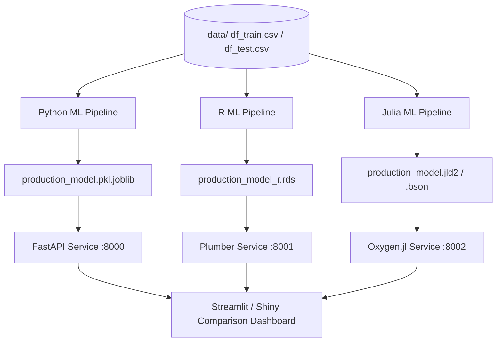

# ⚡ Energy Forecast Hub Remake Guideline

This document provides a step-by-step roadmap and architectural design for remaking the **Energy Forecast Hub** application using a multi-language approach (**Python**, **R**, and **Julia**).

---

## 🏗️ Target Architecture

The remade system will use a shared data layer, parallel model training pipelines in all three languages, and independent microservice APIs that feed into a central comparison dashboard.

---

## 🗓️ Remake Roadmap

### Phase 1: Environment & Package Management
Establish reproducible, isolated environments for all three languages.
*   **Python**: Setup Poetry or Pipenv to replace `requirements.txt`.
*   **R**: Initialize `renv` to manage R dependencies hermetically.
*   **Julia**: Use `Pkg` with a localized `Project.toml` and `Manifest.toml`.

### Phase 2: Feature Engineering & Preprocessing Alignment
Ensure that data parsing and temporal feature engineering are identical across all three languages to ensure fair comparisons.
*   **Target Features**: `year`, `month`, `semester`, `quarter`, `day_in_week` (categorical), `week_in_year`, `day_in_year`.
*   **Python**: Modernize [src/preprocessing.py](file:///mnt/c/Users/jconza/Downloads/energy-forecast-hub/src/preprocessing.py) with explicit typing and date-parsing safety.
*   **R**: Refactor [R_project/R/processing.R](file:///mnt/c/Users/jconza/Downloads/energy-forecast-hub/R_project/R/processing.R) using `lubridate` and strict date validators.
*   **Julia**: Write a preprocessing module `src/preprocessing.jl` using `DataFrames.jl` and `Dates`.

### Phase 3: Machine Learning Pipelines
Implement standard train/test evaluation using cross-validation.
*   **Models**: Linear Regression, Random Forest, and XGBoost.
*   **Python**: Update [main.py](file:///mnt/c/Users/jconza/Downloads/energy-forecast-hub/main.py) and [src/training.py](file:///mnt/c/Users/jconza/Downloads/energy-forecast-hub/src/training.py) to use `TimeSeriesSplit` cross-validation.
*   **R**: Enhance [R_project/train_comparison.R](file:///mnt/c/Users/jconza/Downloads/energy-forecast-hub/R_project/train_comparison.R) to use `rsample::rolling_origin` for validation.
*   **Julia**: Create `src/train.jl` using packages like `MLJ.jl`, `DecisionTree.jl`, and `XGBoost.jl` with an identical validation strategy.

### Phase 4: API Layer & Serialization
Build unified REST microservices exposing a `POST /predict` endpoint.
*   **Python (FastAPI)**: Keep serving from [app.py](file:///mnt/c/Users/jconza/Downloads/energy-forecast-hub/app.py) but implement asynchronous handlers. Expose on port `8000`.
*   **R (Plumber)**: Update [R_project/api.R](file:///mnt/c/Users/jconza/Downloads/energy-forecast-hub/R_project/api.R) to use structured logging and error handling. Expose on port `8001`.
*   **Julia (Oxygen.jl or Genie.jl)**: Create `api.jl` loading the saved Julia model and serving predictions over HTTP. Expose on port `8002`.

### Phase 5: Unified Comparison Dashboard
Upgrade the frontend to allow real-time forecasting comparison across all three backends.
*   **Streamlit Dashboard**: Update [dashboard.py](file:///mnt/c/Users/jconza/Downloads/energy-forecast-hub/dashboard.py) with:
    *   Dropdown to select backend (Python, R, Julia) or compare all three simultaneously.
    *   Plotly graphs showing predicted consumption curves plotted against each other.
    *   Latency/execution speed metrics for each model.

### Phase 6: Orchestration & Dockerization
*   Add a Julia Dockerfile `Dockerfile.julia` using `PackageCompiler.jl` to compile a sysimage (reducing warmup latency).
*   Refactor [docker-compose.yml](file:///mnt/c/Users/jconza/Downloads/energy-forecast-hub/docker-compose.yml) to spin up:
    1.  `python-api` (Port 8000)
    2.  `r-api` (Port 8001)
    3.  `julia-api` (Port 8002)
    4.  `dashboard` (Port 8501)

---

## 🛠️ Language Specific Recommendations

| Language | ML Packages | API Packages | Env Manager | Key Recommendations |
|---|---|---|---|---|
| **Python** | `scikit-learn`, `xgboost` | `fastapi`, `uvicorn` | `Poetry` | Use `Pydantic v2` for fast JSON validation; use `joblib` for model caching. |
| **R** | `tidymodels`, `ranger`, `xgboost` | `plumber` | `renv` | Ensure all dates are parsed using `lubridate` and error handled. |
| **Julia** | `MLJ.jl`, `DecisionTree.jl` | `Oxygen.jl` | `Pkg` | Precompile the API package to a custom sysimage using `PackageCompiler.jl` to bypass JIT compilation lag during Docker container startups. |

---

## 🚀 Execution Strategy in Antigravity IDE

When implementing this remake within Google Antigravity IDE:
1.  **Step-by-Step Execution**: Create environment files first, then the core libraries, then the APIs, and finally the dashboard.
2.  **Terminal Integration**: Use separate terminal tabs for each language's runtime to run and test components interactively.
3.  **Validation**: Test APIs locally using `curl` or automated python scripts before wiring them to the Streamlit frontend.
